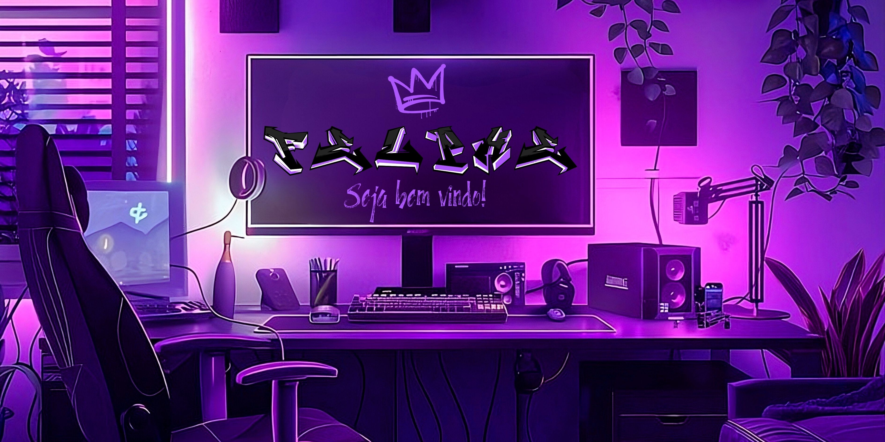
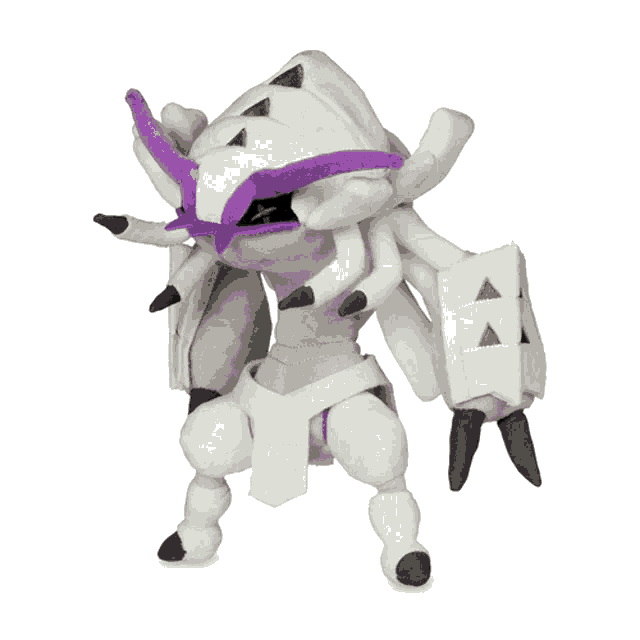
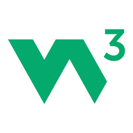

<!-- Banner  -->

<!--  views/stars/followers -->
 

 

**Who Am I?**

I am a student in training to become an Automation Engineer, constantly exploring everything that technology has to offer.
My journey is driven by curiosity and the desire to understand how systems, machines, and software interact to create efficient and intelligent solutions.

Throughout my studies, I have been immersing myself in different areas of technology, from programming and control systems to automation and emerging technologies.
I enjoy learning how to connect theory with real-world applications, always seeking to expand my technical and analytical skills.

As I continue my path in engineering, I aim to explore new tools, frameworks, and innovations, using technology not only to solve problems, but also to optimize processes and build smarter, more reliable systems.

 

<!-- Gif  -->

  

<!-- A Little More About Me -->
 <h3 align="center">
  
  A Little More About Me 
  
 </h3>

I really like challenges and studying. 
At the moment, I study all theory alone.  
I am 18 years old.  
I love music, mainly hip-hop, rock and pop. 
webcore enthusiast.
ㅤ

  <!-- spotify and more -->
  

  
   
  

  

 

<!-- github status-->
<h3 align="center">

 Github Status 
</h3>
 

<!-- Status -->

<!-- Academic Training-->
<h3 align="center">

 Academic Training
</h3>
 

<!-- Academic Badge-->

<!-- My Tech Stack -->

<h3 align="center">
 
 My Tech Stack
</h3>

 

     
     
     
    

 

<!-- My Best Repositories -->

  <h3>
   
   My Best Repositories
  </h3> 

  

    
   

 

  

